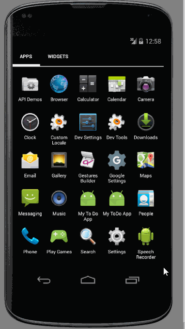
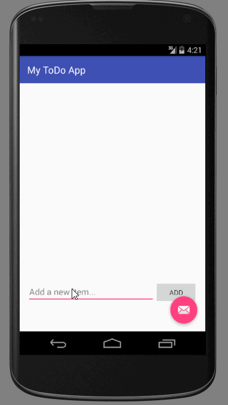

# MyToDoApp

[Updated: Jun-29-2016] Features Added:

 * [x] Splash Screen upon App Launch
 * [x] In addition to a ToDo Task, User can assign a Due date, Priotiy and status to the task
 * [x] User an edit/update any of the above ToDo Task attributes 
 * [x] Task list is color coded (Item is RED if its yet to start, Item is green if in progress and is greyed out if task is completed)
 * [x] User can close and reopen the app and the most recently updated to do list (and all related attributes) persists
 
 Walkthrough of the most recent version of the App:

This is a demo of my first Android application called MyToDoApp. 

An app which enabes you to build a "To Do List" and maintain it by being able to perform baisc operatons like adding an item to it, removing an item from the list and editing an existing item. Also, upon closing the app, most recently updated list is saved and is made available upon reopening the app.

Time spent: 7 hours spent in total

Completed user stories:

 * [x] Required: User starts with an empty to do list, when launching the app for the very first time
 * [x] Required: User can add a to do item to the list
 * [x] Required: User can click an existing to do item to edit and save it
 * [x] Required: User can long click an existing to do item to delete it
 * [x] Required: User can close and reopen the app and the most recently updated to do list persists
 * [x] Optional: Feedback upon deleting an item
 * [x] Optional: Feedback adding a new item
 
Walkthrough of all user stories:

GIF created with [LiceCap](http://www.cockos.com/licecap/).

